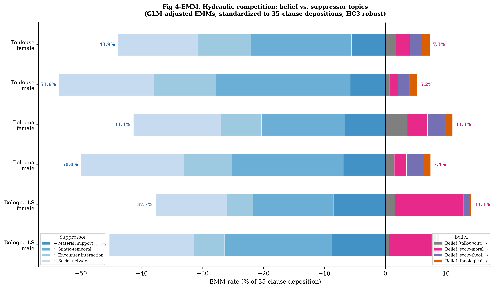
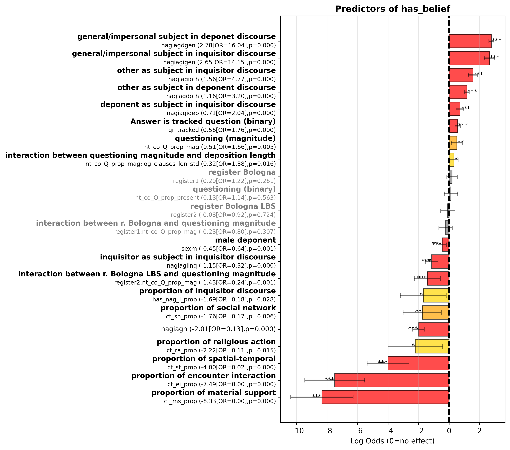
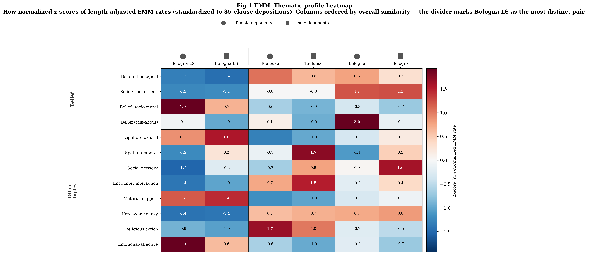
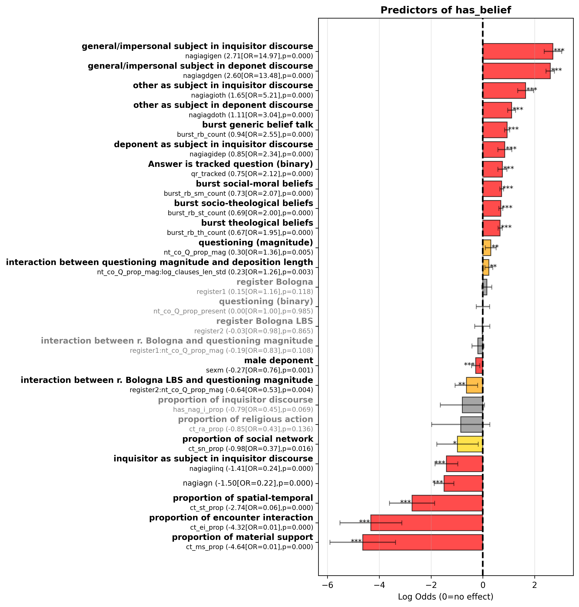

# Medieval Inquisition Trial Data: Discursive mapping of religious belief in Languedoc and Lombardy (13th-14th Century)

## Overview

This repository contains research data and analysis outputs from a quantitative study of belief-acting performatives in medieval inquisition trial depositions. The dataset comprises 27,850 clauses extracted from 801 selected depositions across two historical inquisitorial registers — Toulouse and Bologna, 13th-14th century Southern France and Northern Italy — with Bologna's material analytically split into two sub-registers (ordinary proceedings and the Liber Securitatum campaign), for three register codes total.

## Citation

Cite **the paper** if you're referencing this study's findings, argument, or
methodology. Also cite **the dataset** (separately, in addition to the
paper) if you're reusing the data itself — for replication, a different
analysis, or tooling built on top of it. If in doubt, cite both.

### The paper

Hampejs, Tomáš, Robert L.J. Shaw, and David Zbíral. "The Performance of Religious Belief in Medieval Inquisition Records: A Structural Analysis Using LLM Data Extraction and Multilevel Regression." In *Digital Humanities and Religions of the Past*, edited by František Válek. De Gruyter, forthcoming.

```bibtex
@incollection{hampejs2026belief,
  author    = {Hampejs, Tom{\'a}{\v s} and Shaw, Robert L.J. and Zb{\'i}ral, David},
  title     = {The Performance of Religious Belief in Medieval Inquisition Records: A Structural Analysis using {LLM} Data Extraction and Multilevel Regression},
  booktitle = {Digital Humanities and Religions of the Past},
  editor    = {V{\'a}lek, Franti{\v s}ek},
  publisher = {De Gruyter},
  year      = {2026},
  note      = {Forthcoming}
}
```

### The dataset

Hampejs, Tomáš, Robert L.J. Shaw, and David Zbíral. *belief-acting-annotations:
Clause-Level Annotations of Belief-Acting in Medieval Inquisition
Depositions of Toulouse (1273-1282) and Bologna (1291-1310)* [Data set]. DISSINET, 2026. https://github.com/DISSINET/belief-acting-annotations

```bibtex
@misc{hampejs2026beliefactingannotations,
  author    = {Hampejs, Tom{\'a}{\v s} and Shaw, Robert L.J. and Zb{\'i}ral, David},
  title     = {belief-acting-annotations: Clause-Level Annotations of Belief-Acting in Medieval Inquisition Depositions of Toulouse (1273-1282) and Bologna (1291-1310)},
  year      = {2026},
  publisher = {DISSINET},
  url       = {https://github.com/DISSINET/belief-acting-annotations},
  note      = {Data set}
}
```

## Research Context

This dataset examines how religious belief was performed and constructed through interrogative discourse in medieval inquisition trials. The analysis focuses on the procedural dynamics, thematic contexts, and sequential patterns of belief-acting performatives across different institutional settings.

**Temporal Coverage:** 13th-14th centuries
**Geographic Coverage:** Languedoc (France) and Lombardy (Italy)
**Registers:** two historical registers, three analytical register codes
(Bologna's material splits into two campaigns):
- Toulouse (register code: 0)
- Bologna, ordinary proceedings (register code: 1)
- Bologna, Liber Securitatum campaign — "Bologna LS" (register code: 2)

**Historical sources / editions**
- _Toulouse register_: Biller, Peter, Caterina Bruschi, and Shelagh Sneddon, eds. Inquisitors and Heretics in Thirteenth-Century Languedoc: Edition and Translation of Toulouse Inquisition Depositions, 1273-1282. Brill, 2011.
- _Bologna register_: Paolini, Lorenzo, and Raniero Orioli, eds. Acta S. Officii Bononie ab anno 1291 usque ad annum 1310. Vols 1–3. Fonti per la storia d’Italia 106. Istituto storico italiano per il Medio Evo, 1982. 


**Total Observations:**
- 27,850 clauses  (extracted data)
- 801 depositions (input data)
- 2 historical inquisitorial registers, 3 register codes (Bologna divided into two analytical sub-registers)

## Key Research Findings

**Thematic saturation.** Material/social content and belief essentially
never co-occur in the same deposition (material support: OR = 0.00,
log-odds -8.09; spatio-temporal: OR = 0.03, log-odds -3.52). Belief has a
rough fixed ceiling per deposition; other content is elastic and expands
to fill whatever length a deposition has — converting to proportions
mechanically turns that scaling difference into a strong negative
association, without belief and other content actively displacing one
another clause-by-clause. See "Known post-submission corrections" below
for how this finding was refined after submission (a coarser,
passage-level persistence effect coexists with the saturation mechanism).



**Grammar of belief.** Generic subjects (God, Church, souls) massively
predict belief-acting: deponent statements with a generic subject carry
OR = 16.04 (1504% increase); for theological content specifically,
OR = 48.42 (4742% increase). "God created souls" counts as belief-acting;
"I saw the priest" does not — the distinction tracks grammatical subject
type, not topic alone.



**Register specialization.** Bologna LS (Liber Securitatum) shows a
distinct content profile relative to Toulouse: socio-moral beliefs
OR = 6.88 (688% increase), theological beliefs OR = 0.25 (75% decrease) —
consistent with a campaign focused on moral policing rather than
doctrinal investigation.



**Interactional dynamics.** Belief subtypes show distinct "hydraulic"
patterns in how inquisitor-initiated vs. deponent-initiated discourse
sustains them: theological belief is a "flash flood" (high intrinsic
momentum, β=1.16; low inquisitorial leverage, β=0.36, 24% contribution);
socio-theological belief is a "pump" (low intrinsic momentum, β=0.88;
high inquisitorial leverage, β=0.72, 45% contribution); socio-moral
belief is a "channeled stream" (balanced, β=0.87 intrinsic / β=0.60
induced, 41% contribution). This subtype-level pattern strengthens under
post-submission correction (see below); the separate claim that the
*aggregate* belief measure is exceptionally clustered does not survive
the same correction.



### Corpus at a glance

[`belief_treemap_islands_named.pdf`](belief_treemap_islands_named.pdf) plots
all 801 depositions at once: one glyph per deposition (circle = female
deponent, square = male), grouped into the three register islands above,
sized by deposition length, each glyph a stacked bar of that deposition's
own topic composition. Deponent name and deposition code are searchable
text in every glyph — open the PDF and use your reader's find function to
jump straight to a specific deposition. Two alternate orderings of the
same 801 glyphs are also included:
[`belief_treemap_islands_named_by_id.pdf`](belief_treemap_islands_named_by_id.pdf)
(flat sequence sorted by deposition ID, no size-tier grouping) and
[`belief_treemap_islands_named_by_person.pdf`](belief_treemap_islands_named_by_person.pdf)
(same size-tier grouping as the default, but depositions from the same
person are clustered together with a light-gray backdrop).

## Repository Structure

### Data Files

#### Primary Data

- **`clauses.csv`** (27,850 rows): Clause-level observations with content coding, sequential context, and discourse markers, full-text stripped
- **`depositions.csv`** (801 rows): Deposition-level aggregates including belief counts, narrative types, and participant information
- **`regression_agg_belief_data.csv`** (27,775 rows): Analysis-ready dataset with proportions, standardized variables, and derived measures for regression modeling

#### Supporting Materials

- **`extraction_prompt.txt`**: Guidelines for Latin clause extraction and annotation, including verbal complex identification rules and clause segmentation principles
- **`json_examples/`**: Two annotated examples demonstrating the hierarchical clause structure. They represent the LLM output. 
  - `T14-001_extraction.json`: Example from Toulouse register
  - `T77-01-005_extraction.json`: Example from Bologna register
  - `readme.md`: Documentation of JSON structure

#### Analysis Outputs

- **`all_models_results_20260129_121753.xlsx`**: Comprehensive results from all regression models
- **`all_models_results_20260129_121753_sets.xlsx`**: The same model results, organized by variable set
- **`beliefs-descriptives.docx`**: Descriptive statistics for belief variables
- **`ct_nt_descriptives.xlsx`**: Descriptive statistics for all content topic (CT) and narrative type (NT) variables, organized by register and deponent sex (6 groups: Toulouse f/m, Bologna non-LS f/m, Bologna LS f/m). For each variable, provides total counts and per-deposition statistics (mean / median / std).
- **`figures/`**: `has_belief`'s full four-model coefficient/EMM progression, its random-effects diagnostics at each model stage, and a cross-model effect-size heatmap
- **`supplementary_analyses/length_adjustment/`**: GLM length-adjustment methodology, plus the three-panel comparison (predictions / EMM / compact letter display, HC3-robust) and its backing data — same format as `supplementary_analyses/replication_data/`'s equivalent, for direct canonical-vs-replication comparison. See `supplementary_analyses/length_adjustment/README.md`.
- **Descriptive figures (repo root)**: `fig1_emm_popular_thematic_heatmap.png`, `fig2_emm_popular_discursive_budget.png`, `fig3_emm_belief_composition.png`, `fig4_emm_diverging_bars.png`, `fig5_emm_sex_slopes.png`, `fig6_emm_forest.png` — length-corrected (GLM-adjusted Estimated Marginal Means) descriptive figures. `fig_model2_saturation_coefs.png` visualizes Model 2's fitted coefficients (see "Known post-submission corrections" below for the saturation mechanism). `supplementary_analyses/descriptives_methodology_comparison/` shows the same data under raw and inverse-length-weighted normalization alongside the EMM figures, demonstrating why length-correction matters for this corpus — see `descriptive.figures.readme.md` for the full three-method comparison.
- **`belief_treemap_islands_named.pdf`**: Vector treemap of all 801 depositions, one glyph per deposition (circle = female deponent, square = male), grouped into three register "islands" and sized by deposition length; each glyph is a stacked bar of that deposition's own topic composition. Deponent name and deposition code are real, searchable/selectable text in every glyph, not rasterized labels. `belief_treemap_islands_named_by_id.pdf` and `belief_treemap_islands_named_by_person.pdf` are alternate orderings of the same 801 glyphs (flat deposition-ID sequence; same-person depositions clustered together), same searchable-text property.
- **`supplementary_analyses/replication_data/`**: Summary tables backing the full-corpus replication (see "Validation" above and `REPLICATION.md`).
- **`supplementary_analyses/burst_saturation/`**: Code and write-ups backing the Model 4 aggregate-vs-subtype correction and the suppression→saturation reframing (see "Known post-submission corrections" below and `POST_SUBMISSION_CORRECTIONS.md` #1/#3).

#### Documentation

- **`README.md`**: This file
- **`REPLICATION.md`**: Full-corpus replication methodology and headline numbers
- **`POST_SUBMISSION_CORRECTIONS.md`**: Four corrections to specific manuscript claims, made after submission
- **`descriptive.figures.readme.md`**: Methodology and per-figure discussion for the descriptive figures, across all three normalization sets (raw / inverse-length-weighted / EMM)
- **`supplementary_analyses/descriptives_methodology_comparison/README.md`**: Index for the raw/ILW/alternate-layout figure variants in that folder
- **`supplementary_analyses/replication_data/README.md`**: What each replication summary table is and which script produced it
- **`supplementary_analyses/burst_saturation/README.md`**: Which script backs which correction in `POST_SUBMISSION_CORRECTIONS.md`
- **`json_examples/readme.md`**: JSON extraction-output structure and field definitions
- **`supplementary_analyses/length_adjustment/README.md`**: Length-adjustment methodology for the extended deposition-level datasets
- **`figures/README.md`**: Legend and naming convention for the GLMM statistical-output figures

## Data Structure

The data follows a three-level hierarchical structure:

1. **Institutional Level (Macro)**: Register differences, gender patterns
2. **Deposition Level (Meso)**: Aggregate proportions and ratios within individual interrogations
3. **Clause Level (Micro)**: Individual performative acts and their sequential context

## Variable Documentation

### clauses.csv

Clause-level observations (N = 27,850) representing individual performative acts within depositions. These data were collected by LLM extraction (Claude Sonnet 4.5, see extraction_prompt.txt) as JSON files for each deposition. The full text is removed from the dataset. For example of raw LLM transformed data with full text, see json_examples.

#### Identifiers
- **`clause_action_id`** (string): Unique clause identifier (format: `DEPOSITION_cN` where N is clause number)
- **`deposition_code`** (string): Deposition identifier linking to depositions.csv
- **`clause_position`** (float): Sequential position of clause within deposition (1-based)

#### Institutional Context
- **`register`** (int): Inquisitorial register
  - `0` = Toulouse
  - `1` = Bologna
  - `2` = Bologna LS
- **`sex`** (string): Gender of deponent
  - `m` = male
  - `f` = female

#### Verbal Complex (VCX) Variables

Each clause is built around a verbal complex - an aggregation of verbal elements denoting a complete action, state, or event.

- **`v`** (string): Verbal complex in Latin - The actual Latin text of the verb or verb phrase
  - Examples: "interrogatus", "viderat", "esset eundi", "credit"
  - Inferred/elided verbs marked with angle brackets: `<est>`, `<sum>`, `<vocabatur>`

- **`vl`** (string): Verbal complex lemma - The dictionary/base form of the verb
  - Examples: "interrogo", "uideo", "sum", "credo"
  - Inferred lemmas also marked with angle brackets: `<sum>`, `<uoco>`

- **`va`** (string): Verbal complex actuality - How the action is presented from the immediate actor's perspective
  - `a` = Actual (presented-as-actual) - The claim is presented as actual
  - `n` = Non-actual (presented-as-non-actual) - The claim is negated or rejected (e.g., "did not see")
  - `h` = Hypothetical (presented-as-hypothetical) - The claim is questioned (e.g., in interrogative frames like "whether he saw")
  - `u` = Unclear - Actuality cannot be determined

- **`vt`** (string): Verbal complex temporality - Temporal framing of the action
  - `t` = Testimony-time - Acts happening during the testimony event itself (testifying, questioning, recording)
  - `r` = Reported-past - Events outside testimony and before testimony-time
  - `g` = General-time - Claims about how the world, people, things generally are (timeless/habitual)
  - `f` = Future-time - Acts projected to the future beyond testimony-time

Note: In "Deponent said that he did not see heretics": "said" has va=a, vt=t (actual testimony-time), while "see" has va=n, vt=r (non-actual reported-past)

#### Content Topics (CT)

Binary indicators (0.0 or 1.0) for thematic content. Variable names follow pattern `ct_[code]`:

##### Belief-Acting Types (rb)

Religious beliefs are opinions, attitudes, and convictions representing a general religious outlook concerning religious figures/groups, practices, and thought. They do NOT include reportage, knowledge claims, or simple moral/legal judgments concerning specific persons or acts. Importantly, religious belief INCLUDES content denying, questioning, or mocking religious actors, supernatural actors, religious objects, or religious states (e.g., preferring natural to theological explanations).

- **`ct_rb`**: Religious belief (general belief content without specific subcategory; includes explicit talk about faith, orthodoxy, heterodoxy without further specification, e.g., "saying anything against Catholic faith", "as the Roman Church believes")

- **`ct_rb.sm`**: Socio-moral belief - Moral quality judgments of religious figures, groups, or practices that express or imply a **broader religious/moral outlook** on the state of religion and society (not case-specific judgments of individuals)
  - Examples: "heretics are good people", "the friars are wicked", "it is not good to venerate saints"
  - Excludes: "that friar was not a good man" (specific individual judgment → use ct_is instead)

- **`ct_rb.st`**: Socio-theological belief - Content referring to the **supernatural efficacy** of religious figures/groups/institutions and practices; includes institutional legitimacy (e.g., authority succession) and opinions on correct/incorrect performance of practices
  - Examples: "heretics save", "priests of Roman church cannot administer sacraments", "pilgrimages make no difference for the soul", "Roman church cannot provide salvation", "one must confess to God alone, not to priests"

- **`ct_rb.th`**: Theological belief - Content related **solely to supernatural/metaphysical actors or entities**
  - Examples: "God and his saints are in heaven", "God has only one person", "there are two principles governing the world and the heavens"

##### Other Content Topics

**Important distinction:** DOING religious practice (e.g., "he went to confess") = ct_ra (religious_action); BELIEVING IN religious practice (e.g., "confession saves souls") = ct_rb.st (socio-theological belief)

- **`ct_ra`**: Religious action - Physical actions (kneeling, crossing) or speech actions (praying) realizing religious behavior individually or with others; includes actions considered superstitious by inquisitors; EXCLUDES communication of belief
- **`ct_sn`**: Social network - Information about persons, relationships, and social connections
- **`ct_st`**: Spatial-temporal - Information about places, movements, times, and spatial relationships
- **`ct_ho`**: Heresy/orthodoxy status judgment - Explicit, specific, novel judgment, belief, or state of knowledge (awareness/lack thereof) attributing religious orthodoxy or heretical status to an individual/group. This is the **cognitive act of judging** someone as heretic/orthodox or the **state of awareness** of that status
  - Includes: "He believes X is a heretic" (judgment), "They condemned the group as heretics" (act of judging), "He did not know they were heretics" (lack of awareness), "He knew they were heretics" (awareness)
  - Excludes: "He saw heretics" (simple label), "The heretics left" (simple identification - judgment was done elsewhere), "He believed they have good faith" (broader quality judgment → use ct_rb.sm instead)
- **`ct_cm`**: Communal meal - Physical collective action involving eating or preparation of collective meals
- **`ct_bs`**: Belief spread - Public action/event with intention to transmit, propagate, or exchange heterodoxical belief/practice/doctrine; includes preaching, teaching, disputing, book exchange, listening, being introduced to (excludes revealing to orthodoxy authorities)
- **`ct_ei`**: Encounter/interaction - Meetings, conversations, and social interactions not classified elsewhere
- **`ct_ea`**: Emotional/affective - Emotional states and affective responses
- **`ct_bn`**: Biographical narrative - Life events, actions, and biographical information
- **`ct_lp`**: Legal procedural - Content constituting or narrating legal/inquisitorial procedure
- **`ct_ms`**: Material support or exchange - Material support provided to persons (housing, financial services), exchange of goods/services/information associated with support or exchange
- **`ct_is`**: Identity/status - Judgments about specific individuals' character or status (not religious outlook)
- **`ct_ot`**: Other - Content non-classifiable in above categories
- **`ct_NA`**: Not applicable - Used for governing clauses without prepositional/noun phrase content (content is in subordinate clause)

Note: `CT` column contains list of topic codes present in clause (may be empty list `[]`)

#### Narrative Type (NT)

Classifies the communicative function of each clause based on its verbal complex. Format: `category.subcategory`

**Categories:**
- **`ta.*`** = Trial state or act - Direct events/actions occurring in testimony-giving event (not communication/cognition acts)
- **`co.*`** = Communicative - Actions of communicating/asking/reporting (governs content in subordinate clauses)
- **`cg.*`** = Cognitive - Actions/states of cognition (knowing, believing, deciding, wishing; governs content in subordinate clauses)
- **`nc`** = Narrative content - Events/actions/states forming the subject matter of testimony (the "story" being told); verbal complex is NOT cognitive or communication verb

**Subcategories:**

*Trial state or act (ta.):*
- **`ta.ed`**: Event details - Information about testimony event (date, place, present persons)
- **`ta.wd`**: Witness details - Information about witness and manner of appearance
- **`ta.lp`**: Legal procedural actions - Legal procedural actions (e.g., "sworn")

*Communicative (co.):*
- **`co.iq`**: Inquiry - Questioning/request initiating new line of questioning (testimony-time or reported)
- **`co.ro`**: Response-originated inquiry - Question/request following and seeking elaboration of content from immediately preceding response
- **`co.dr`**: Direct response - Direct response to inquiry or response-triggered inquiry
- **`co.er`**: Elaborative response - Response narrated as additional elaboration or explanation
- **`co.us`**: Unsolicited statement - Non-inquiry communication not originating from any previous inquiry semantics

*Cognitive (cg.):*
- **`cg.bo`**: Belief or opinion - Expression of tentative knowledge, opinion, judgment, or belief (prototypical verb: "credo")
- **`cg.kc`**: Knowledge claim - Expression of factual claim or understanding about something
- **`cg.rc`**: Recollection - Expression focusing on remembering
- **`cg.pc`**: Perception - Expression of perceiving through senses (saw, heard)
- **`cg.iv`**: Intentional/volitional - Expressions of intention, desire, or volition

Note: Communication and cognitive verbs retain their NT classification regardless of syntactic embedding (e.g., within "cum" clauses or deep subordination)

#### Discourse Markers (Agency Classification)

Two independent dimensions classifying each clause's discourse position:

**NAG (Narrative Agency)** - Discourse frame embedding
- **`nag`** (string): Identifies whose discourse the clause is embedded in (trace to highest governing communication verb)
  - `i` = Inquisitor discourse - Inquisitorial questions, statements, allegations, and all subordinated clauses
  - `d` = Deponent discourse - Deponent's responses, narrations, statements, and all subordinated clauses
  - `n` = Notary discourse - Notarial recording and trial procedural framing

**IAG (Immediate Agency)** - Doer of the action
- **`iag`** (int): Binary indicator for burst initiation (0 = non-initiator, 1 = initiator)
  - In clause-level data, identifies whether the clause initiates a belief-acting burst

Note: The data also contains derived string variable indicating the grammatical subject/agent of the clause's verbal complex:
  - `dep` = Deponent subject - Deponent is the doer/grammatical subject (explicit, implicit, or reflexive)
  - `inq` = Inquisitor subject - Inquisitor/trial authority is the doer (e.g., "Interrogatus" = interrogated BY inquisitor)
  - `oth` = Other subject - Another specific person/persons is the doer
  - `gen` = General subject - Impersonal constructions, theological/metaphysical entities, abstract subjects

**NAGIAG (Combined Agency)**
- **`nagiag`** (string): Combined narrative-interrogative agency code (format: `[i/n/d][dep/inq/oth/gen]`)
  - First character indicates discourse frame (i/n/d from NAG)
  - Remaining characters indicate immediate agent (dep/inq/oth/gen from IAG)
  - Examples: `idep` = inquisitor discourse, deponent subject; `ddep` = deponent discourse, deponent subject; `ioth` = inquisitor discourse, other subject

#### Question Tracking (Semantic Relations)

Tracks semantic relationships between questions and responses:

- **`qr`** (list): Question-response tracking - Lists clause IDs and response types this clause addresses (format: `["cid.type", ...]`)
  - Response types:
    - `ea` = Elaborated answer (to open questions: quid, quomodo, cur, unde, quando, ubi, quare)
    - `af` = Affirmation (yes to closed question)
    - `dn` = Denial/rejection (no to closed question)
    - `nk` = No knowledge ("nescivit", "non scivit")
    - `pr` = Partial (answers only some parts of compound question)
  - Example: `["c12.dn"]` means this clause denies the question in clause c12
  - Empty list `[]` indicates no response relationship

- **`qr_tracked`** (int): Binary indicator (0/1) for whether clause is tracked as response to any question
  - `1` = This clause responds to at least one question
  - `0` = This clause does not respond to any question

Note: Tracking targets clauses with substantive content (CT ≠ NA) rather than communicative frames. Elliptical responses inherit content topics from their targets.

#### Belief Presence
- **`has_belief`** (int): Binary indicator (0/1) for presence of any belief-acting content

#### Sequential Context (Burst Variables)

Counts of specific features in ±3 clause window around focal clause:

- **`burst_has_belief_count`** (float): Count of belief-acting clauses in burst window
- **`burst_rb.sm_count`** (int): Count of socio-moral belief clauses in burst
- **`burst_rb.st_count`** (int): Count of socio-theological belief clauses in burst
- **`burst_rb.th_count`** (int): Count of theological belief clauses in burst
- **`burst_rb_count`** (int): Count of general belief clauses in burst
- **`burst_initiator`** (string): Burst context classification
  - `i` = initiator burst (focal clause initiates)
  - `d` = dependent burst (focal clause depends)
  - `non_burst` = not in burst context

### depositions.csv

Deposition-level aggregates (N = 801) summarizing entire interrogation sessions.

#### Identifiers
- **`deposition_code`** (string): Unique deposition identifier
- **`participant_id`** (string): Deponent participant code
- **`deponent_label`** (string): Name and description of deponent (Latin/vernacular)

#### Institutional Context
- **`register`** (int): Inquisitorial register (0 = Toulouse, 1 = Bologna, 2 = Bologna LS)
- **`sex`** (string): Gender (m/f)

#### Deposition Characteristics
- **`clauses_len`** (int): Total number of clauses in deposition
- **`no_belief`** (int): Count of clauses without belief content
- **`count_belief`** (int): Count of clauses with belief content

#### Content Topic Counts

Total counts of each content topic in deposition (same codes as clauses.csv):
- **`ct_ra`**, **`ct_rb`**, **`ct_rb.st`**, **`ct_rb.sm`**, **`ct_rb.th`**
- **`ct_ms`**, **`ct_sn`**, **`ct_st`**, **`ct_ho`**, **`ct_cm`**
- **`ct_bs`**, **`ct_ei`**, **`ct_ea`**, **`ct_bn`**, **`ct_lp`**

#### Narrative Type Counts

Total counts of each narrative type in deposition:

**Communicative (co.)**
- **`nt_co.iq`**: Inquiry - Questions/requests initiating new questioning lines
- **`nt_co.ro`**: Response-originated inquiry - Questions following/elaborating on prior response content
- **`nt_co.us`**: Unsolicited statement - Non-inquiry communication not responding to inquiry
- **`nt_co.dr`**: Direct response - Direct responses to inquiries
- **`nt_co.er`**: Elaborative response - Additional elaboration or explanation responses

**Cognitive (cg.)**
- **`nt_cg.bo`**: Belief or opinion - Expressions of belief, opinion, judgment
- **`nt_cg.pc`**: Perception - Perceiving through senses
- **`nt_cg.iv`**: Intentional/volitional - Expressions of intention, desire, volition
- **`nt_cg.kc`**: Knowledge claim - Factual claims or understanding
- **`nt_cg.rc`**: Recollection - Remembering

**Trial state or act (ta.)**
- **`nt_ta.wd`**: Witness details - Information about witness (appears in some depositions but not in official abbreviation list)
- **`nt_ta.lp`**: Legal procedural - Legal procedural actions
- **`nt_ta.ed`**: Event details - Information about testimony event

**Narrative content**
- **`nt_nc`**: Narrative content - Events/actions/states forming testimony subject matter

#### Question Metrics
- **`nt_co.Q`** (float): Count of questions in deposition
- **`nt_co_Q_prop`** (float): Proportion of questions relative to total clauses

### regression_agg_belief_data.csv

Analysis-ready dataset (N = 27,775) with derived variables for regression modeling.

#### Core Variables
All variables from `clauses.csv` plus:

#### Deposition-Level Proportions

Aggregated from deposition level:
- **`ct_ra_prop`** (float): Proportion of religious action content in deposition
- **`ct_sn_prop`** (float): Proportion of social network content in deposition
- **`ct_st_prop`** (float): Proportion of spatial-temporal content in deposition
- **`ct_ms_prop`** (float): Proportion of material support/exchange content in deposition
- **`ct_ei_prop`** (float): Proportion of encounter/interaction content in deposition

#### Standardized Variables
- **`log_clauses_len_std`** (float): Standardized log-transformed deposition length

#### Derived Agency Variables
- **`has_nag_i_prop`** (float): Proportion of initiator agency clauses in deposition

#### Question Presence
- **`nt_co_Q_prop_present`** (int): Binary indicator (0/1) for presence of questions
- **`nt_co_Q_prop_mag`** (float): Magnitude of question proportion (when present)

#### Sequential Context
- **`burst_rb_sm_count`**, **`burst_rb_th_count`**, **`burst_rb_st_count`**, **`burst_rb_count`**: Same as clauses.csv burst variables

#### Response Variables
- **`has_belief`** (int): Primary binary outcome for belief-acting presence

## Analytical Framework

The analysis employs Generalized Linear Mixed-Effects Models (GLMM) with logistic regression:

### Model Progression

1. **Model 1 (Null)**: Baseline with random effects for deposition
2. **Model 2 (Thematic Context)**: Adds content topic proportions
3. **Model 3 (Procedural Dynamics)**: Adds discourse markers and question tracking
4. **Model 4 (Interactional Momentum)**: Adds sequential burst variables and interactions

### Random Effects Structure
- Primary grouping: `(1|deposition_code)` - accounts for within-deposition clustering
- Models control for non-independence of clauses within the same interrogation

### Fixed Effects Categories
- **Institutional**: register, sex
- **Thematic**: content topic proportions (ct_ra_prop, ct_sn_prop, etc.)
- **Procedural**: discourse agency (nagiag), question tracking (qr_tracked)
- **Interactional**: burst context variables
- **Length control**: log-transformed standardized deposition length

## Methodological Notes

### Data Collection
Clauses were extracted via LLM (Claude Sonnet 4.5) from the published Latin editions, following systematic guidelines (see `extraction_prompt.txt`). Each clause represents a **verbal complex (vcx)** - an aggregation of verbal elements denoting a complete action, state, or event. Periphrasis elements (finite verb + infinitive/gerund, auxiliaries + participles, modals + infinitives) belong together in a single vcx.

### Clause Segmentation Principles
- **One verbal complex per clause**: Each clause contains exactly one simple or aggregated vcx
- **Semantic priority**: Prioritizes semantic distinctness of actions/states over syntactic compression
- **Reporting verbs**: Always divided (e.g., "He said that he believed the church is evil" → 3 clauses: "said", "believed", "is evil")
- **Question frames**: Separated from content (e.g., "Interrogatus si..." → separate clauses for questioning frame and content)

### Coding Scheme

**Content Topics (CT):**
- Hierarchical coding: rb.sm, rb.st, rb.th are subtypes of rb (religious_belief)
- Multiple topics possible per clause (inclusive coding)
- CT=NA for governing clauses whose content appears in subordinate clauses
- Key principle: Religious belief = general religious outlook, NOT reportage/knowledge claims/specific person judgments

**Narrative Types (NT):**
- Classification based on **verbal complex function**, not syntactic position
- Communication verbs (dicere, interrogare, respondere) → always co.* even when deeply embedded
- Cognitive verbs (credere, scire, videre as perception) → always cg.* even when deeply embedded
- Other verbs → nc (narrative content) or ta (trial procedural)

**Agency (NAG/IAG):**
- NAG (narrative agency): Discourse frame - trace upward to highest governing communication verb
- IAG (immediate agency): Direct grammatical subject/doer of THIS clause's action
- These are independent dimensions: all subordinate clauses inherit NAG from discourse frame, but IAG determined clause-by-clause

**Question Tracking:**
- Targets clauses with substantive content (CT ≠ NA), not communicative frames
- For compound questions with subordinates, target the topical content in subordinate clauses
- Elliptical responses inherit content topics from their targets

### Sequential Context (Burst Variables)
- Computed with ±3 clause window (7 clauses total including focal clause)
- Burst initiation determined by discourse position and agency structure
- Captures local sequential patterns of belief-acting and discourse dynamics

### Missing Data
- Empty lists `[]` indicate absence of that feature (not missing data)
- Some variables may have sparse coverage depending on register and deposition type
- Bologna LS depositions are on average ~4× shorter than Toulouse depositions (length asymmetry problem)

## Validation

### Sample validation by experts

Two historians independently reviewed 300 (150 each) randomly selected clauses
against the source Latin, checking all annotation dimensions
(segmentation, agency, temporality, content classification): **87%
overall agreement**, broken down by dimension — question–response
tracking 97%, temporality 91%, discourse agency 89%. A further 100
clauses were blind-coded for belief subtype specifically (the
analytically load-bearing dimension for this study's claims): **78%
agreement**, with disagreements concentrated at genuine category
boundaries (e.g. socio-moral vs. socio-theological belief) rather than
scattered at random — itself evidence the taxonomy is doing real
analytic work rather than imposing false precision on the material.

This was zero-shot: no fine-tuning, no in-context examples beyond the
extraction prompt's own worked examples. This is a real spot-check
against expert judgment, not a formal inter-annotator-agreement study
with a reported kappa, and it does not constitute a per-task gold
benchmark across every annotation dimension the prompt bundles — it
cannot isolate which dimension is weakest in isolation from the others.

### Extraction validation

This dataset's statistical conclusions were independently checked by
re-extracting all 801 depositions from scratch with the same LLM
model/prompt/settings and re-fitting the full model sequence, isolating
the LLM extraction step as the only varying factor. Result: full
replication, no exceptions — Model 1's fixed effects reproduce to ~0.02
log-odds, Models 2-4 reproduce with the same sign and significance at
every step, and a subsequent correction to the Model 4 clustering claim
(see `POST_SUBMISSION_CORRECTIONS.md`) reproduces on both its confirmed
and its retracted parts. Full numbers and methodology in
`REPLICATION.md`; the summary data tables backing those numbers are
included in `supplementary_analyses/replication_data/`.

## Known post-submission corrections

A set of post-submission analyses (2026-07) refined or corrected four
claims in the submitted manuscript. None of these change the dataset
itself — they're re-analyses of it. Summarized with pointers in
`POST_SUBMISSION_CORRECTIONS.md`; the short version:

1. Model 4's clustering claim holds at the belief-*subtype* level (and
   strengthens under correction) but not at the belief-*aggregate* level.
2. A related limitation (comparator-topic annotation granularity) is
   stated as irreducible given the current tagset.
3. Model 2's "suppression" framing is better described as saturation —
   belief has a fixed per-deposition ceiling, other content is elastic
   around it, rather than actively displacing it.
4. The sex effect's "it is unclear" mechanism discussion can be sharpened:
   content-crowding is a real partial contributor; two convergent tests
   found no evidence the gap concentrates in institutionally-elicited
   content specifically.


## Statistical Software

Analyses were conducted using:
- **Python** with pymer4 package (interface to R's lme4)
- **R** with lme4 package for mixed-effects modeling

## License

This dataset is made available under the **Creative Commons Attribution 4.0 International (CC BY 4.0)** license.

[](https://creativecommons.org/licenses/by/4.0/)

**You are free to:**
- **Share** — copy and redistribute the material in any medium or format
- **Adapt** — remix, transform, and build upon the material for any purpose, even commercially

**Under the following terms:**
- **Attribution** — You must give appropriate credit, provide a link to the license, and indicate if changes were made. You may do so in any reasonable manner, but not in any way that suggests the licensor endorses you or your use.

**Note on historical sources:** The original medieval Latin manuscripts from which these data were extracted are not in the public domain. This license applies to the derived dataset: the clause segmentation, classifications, annotations, and variable coding produced through this research project.

Full license text is also included locally: `license`. Canonical version: https://creativecommons.org/licenses/by/4.0/legalcode

## Contact

For questions about this dataset:

Tomas Hampejs
Email: tomas.hampejs@mail.muni.cz

## Acknowledgments

This research was conducted as part of ERC funded project DISSINET (2022-2026), see https://dissinet.cz

---

*Last updated: July 2026*
