# Descriptive Figures: CT/NT Distributions Across Register x Sex Groups

## Data Source

All figures draw from the corpus of 27,850 clauses across 801 depositions, broken down into six register-by-sex groups:

| Group | Register | Sex | N depositions | N clauses | Median dep. length |
|-------|----------|-----|---------------|-----------|-------------------|
| Toulouse female | Toulouse | f | 35 | 1,962 | 47 |
| Toulouse male | Toulouse | m | 157 | 10,164 | 44 |
| Bologna female | Bologna non-LS | f | 32 | 1,667 | 36.5 |
| Bologna male | Bologna non-LS | m | 175 | 9,100 | 42 |
| Bologna LS female | Bologna LS | f | 249 | 2,399 | 9 |
| Bologna LS male | Bologna LS | m | 153 | 2,558 | 12 |

**Length asymmetry**: Bologna LS depositions are ~4x shorter than Toulouse and Bologna non-LS (median 9-12 vs. 42-47 clauses). This compresses the discursive space available for substantive content and inflates proportional measures for whatever content survives the compression. The three visualization sets below address this asymmetry with increasing sophistication.

---

## Three Visualization Sets: Methodological Comparison

The same six figure types are produced under three normalization regimes. Each answers a slightly different question and carries different assumptions about the relationship between deposition length and content.

### Set 1: Raw clause-pooled rates

| | |
|---|---|
| **Script** | `ct_nt_visualizations.py` |
| **Files** | `supplementary_analyses/descriptives_methodology_comparison/fig1_thematic_heatmap.png`, `fig2_discursive_budget.png`, `fig4_diverging_bars.png`, `fig5_sex_slopes.png`, `fig6_distribution_summary.png` |
| **Data source** | `ct_nt_descriptives.xlsx` |
| **Method** | rate = total CT clauses in group / total clauses in group |
| **Unit of analysis** | The clause (longer depositions contribute more weight) |
| **Question answered** | "What does the aggregate textual record look like?" |

**Assumptions**: Every clause is equally informative regardless of the deposition it comes from. A 95-clause deposition contributes 95x more to the group profile than a 1-clause deposition. This is appropriate when asking "what proportion of the surviving text discusses belief?" but misleading when asking "what proportion of depositions produce belief?" or "what would a typical deposition contain?"

**Where it works well**: Figs 1, 2 (overall corpus composition). The raw rates accurately describe the textual landscape as encountered by a reader.

**Where it misleads**: Fig 4 (hydraulic competition in Bologna LS). Because LS depositions are short, their total clause contribution is small, and their rates are dominated by a few outlier-length depositions. Legal procedural appears elevated in LS at 41% for women, but this is partly because long LS depositions — which are atypical — have more procedural content.

### Set 2: Inverse-length weighted (ILW) rates

| | |
|---|---|
| **Script** | `ct_nt_visualizations_ilw.py` |
| **Files** | `supplementary_analyses/descriptives_methodology_comparison/fig1_ilw_thematic_heatmap.png`, `fig2_ilw_discursive_budget.png`, `fig4_ilw_diverging_bars.png`, `fig5_ilw_sex_slopes.png`, `fig6_ilw_distribution_summary.png` |
| **Data source** | `depositions.csv` |
| **Method** | rate = mean across depositions of (CT count / deposition length) |
| **Unit of analysis** | The deposition (each deposition contributes equally) |
| **Question answered** | "What proportion of a typical deposition is devoted to this topic?" |

**Assumptions**: Content scales proportionally with deposition length (i.e., doubling the length doubles the expected count). Each deposition is equally informative regardless of length. This is equivalent to a Poisson model with log(length) as an offset.

**Where it works well**: CTs whose count genuinely scales linearly with length — if a topic appears at a roughly constant rate per clause, then count/length is a stable estimator.

**Where it misleads**: CTs with **non-proportional length scaling**. The critical case is legal procedural (`ct_lp`), which has a large "fixed cost" component: every deposition requires ~3-4 procedural clauses (oaths, identification, abjuration formulas) regardless of length. In a 9-clause deposition, 4/9 = 44%; in a 47-clause deposition, 4/47 = 8.5%. Averaging these proportions inflates the rate for groups dominated by short depositions. The ILW gives Bologna LS female a ct_lp rate of **42%**, nearly double the GLM-adjusted estimate of 22.6%.

The same bias — in reverse — affects CTs that scale *superlinearly* with length (e.g., encounter interaction, where longer depositions accumulate encounter narratives at an accelerating rate). ILW overestimates rates in groups with short depositions for fixed-cost variables and underestimates them for superlinear variables.

### Set 3: GLM-adjusted EMM rates

| | |
|---|---|
| **Script** | `ct_nt_visualizations_emm.py` |
| **Files** | `fig1_emm_popular_thematic_heatmap.png`, `fig2_emm_popular_discursive_budget.png`, `fig3_emm_belief_composition.png`, `fig4_emm_diverging_bars.png`, `fig5_emm_sex_slopes.png`, `fig6_emm_forest.png` — all at repo root. fig1/fig2 use a no-dendrogram, icon-strip layout for readability; a dendrogram-layout rendering of the same EMM data is in `supplementary_analyses/descriptives_methodology_comparison/` for readers who want that presentation instead. |
| **Data source** | `3panels_glm_analysis_hc3_robust.pdf` (Panel 1 EMMs) |
| **Method** | Estimated Marginal Means from HC3-robust GLM, standardized to 35-clause depositions |
| **Unit of analysis** | The hypothetical standardized deposition |
| **Question answered** | "If all groups produced 35-clause depositions, how many clauses of each type would they contain?" |

**Model specification**:
```
log(E[count]) = β₀ + Σ β_reg·I(reg=i) + β_sex·I(sex=m) + LENGTH
```
where LENGTH is one of:
- `[O]` = offset(log(len)) — forces proportional scaling (β_len = 1)
- `[L]` = β_len·log(len) — fits a single power-law exponent
- `[L+]` = β_len·log(len) + β_len×reg·log(len)·I(reg=i) + β_len×sex·log(len)·I(sex=m) — allows the length-content relationship to vary by register and sex

The model type (`O`, `L`, or `L+`) is selected per variable based on fit. HC3 heteroskedasticity-consistent standard errors provide robust CIs.

**Why this works**: Each CT gets its own length-scaling parameter. Legal procedural (β_len ≈ 1.0 with reg2 interaction +0.25) scales nearly proportionally in Toulouse/Bologna but superlinearly in LS. Material support (β_len with reg2=+2.18) scales strongly superlinearly in LS. The EMMs project all groups onto a common deposition length (35 clauses), removing the length confound *variable by variable*.

**Where it works well**: Figs 1, 2, 4, 5 — for these, the EMM version is the corrected replacement for the raw/ILW versions, which the comparison in `supplementary_analyses/descriptives_methodology_comparison/` shows were actively misleading (fig1/fig2/fig4) or missing real uncertainty (fig5). **Fig 6 is a different case, not a replacement**: `fig6_emm_forest.png` (model-adjusted expected counts with CIs, for between-group comparison) doesn't supersede `fig6_distribution_summary.png`/`fig6_ilw_distribution_summary.png` (raw-count and per-deposition-proportion distributional shape, incl. zero-inflation and skew) — the three show genuinely different things and are kept as complementary views, not competing normalizations of the same claim.

**Limitations**: The EMMs are model-dependent — they assume the log-linear form is correct. They don't capture distributional features (zero-inflation, skewness) at all — that's what Fig 6's raw/ILW versions are for, not something any EMM figure could show. And EMMs smooth over individual deposition variation that the raw figures preserve.

### Summary: What changes across the three sets

| Pattern | Raw (Set 1) | ILW (Set 2) | EMM (Set 3) |
|---------|-------------|-------------|-------------|
| ct_lp in Bologna LS f | 41.0% | 42.0% | 22.6% |
| ct_ms in Bologna LS f | 1.7% | 1.2% | 8.5% |
| ct_ei in Toulouse m | 15.0% | 11.1% | 10.2% |
| Belief total, Bol.LS f | 12.7% | 12.8% | 15.3% |
| Suppressor total, Bol.LS f | 12.8% | 11.9% | 37.7% |
| Hydraulic ratio (sup/bel), Bol.LS f | 1.0:1 | 0.9:1 | 2.5:1 |
| Hydraulic ratio (sup/bel), Toul.m | 11.5:1 | 10.8:1 | 10.3:1 |

Key reversals under EMM normalization:
- **Material support in LS is NOT suppressed** — it was an artifact of short depositions. The EMM shows LS has *elevated* material support (8.5%) versus Toulouse (5.5%).
- **The hydraulic near-parity in LS female disappears**. Raw/ILW showed belief ≈ suppressors at ~13%. The EMM shows suppressors at 37.7% vs belief at 15.3% — a 2.5:1 ratio, still below other registers but not near parity.
- **Belief in LS female is genuinely the highest** across all three methods (12.7%, 12.8%, 15.3%), confirming this is not a length artifact.

### Recommended usage

- **Set 1 (raw)**: Use when describing the corpus as text — "what share of surviving clauses discuss belief?"
- **Set 2 (ILW)**: Use cautiously for deposition-level comparisons where proportional scaling is reasonable. Avoid for ct_lp and other fixed-cost or superlinear variables.
- **Set 3 (EMM)**: Use for all between-group comparisons where length confounding matters. This is the proper basis for claims about register and sex effects on content composition.

---

## Generation

```bash
# Set 1: Raw clause-pooled
python3 ct_nt_visualizations.py

# Set 2: Inverse-length weighted
python3 ct_nt_visualizations_ilw.py

# Set 3: GLM-adjusted EMMs
python3 ct_nt_visualizations_emm.py
```

All outputs at 300 dpi. Set 1 and Set 2 outputs, plus the non-popular-layout
Set 3 fig1/fig2 variants, live in `supplementary_analyses/descriptives_methodology_comparison/`
(see that section's "Files" rows above for exact
paths). The canonical Set 3 figures (`fig1_emm_popular_*`,
`fig2_emm_popular_*`, `fig3_emm_*` through `fig6_emm_*`) are at project
root.

---

## Set 1: Raw Clause-Pooled Figures

### Fig 1. Thematic Profile Heatmap

**File**: `supplementary_analyses/descriptives_methodology_comparison/fig1_thematic_heatmap.png`

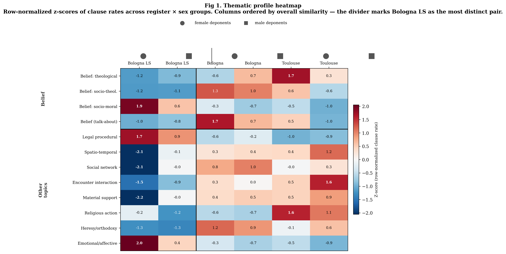

**Method**: Row-normalized z-scores of clause rates (count / total clauses per group) for all 12 content topics. Hierarchical clustering (Ward's method, Euclidean distance) on both rows and columns. Cell values are z-scores; bold = |z| > 1.5.

**What it reveals**: The column dendrogram immediately separates Bologna LS from the other four groups. Three topic clusters emerge in the row dendrogram:

1. **Bologna LS signature** (top cluster): Legal procedural (z=1.7/0.9), socio-moral belief (z=1.9/0.6), and emotional/affective content (z=2.0/0.4) are strongly over-represented in LS, particularly for women.
2. **Toulouse signature** (middle cluster): Religious action (z=1.6/1.1), theological belief (z=1.7/0.3), and encounter interaction (z=0.5/1.6) concentrate in Toulouse, particularly males for encounter and females for theological.
3. **Detective-work cluster** (bottom): Spatio-temporal, material support, social network, heresy/orthodoxy, and encounter interaction are uniformly suppressed in Bologna LS (z = -1.3 to -2.2) and elevated in Toulouse/Bologna.

**Key reading**: The heatmap identifies which groups are *distinctive* relative to the corpus mean. The red-blue pattern confirms that Bologna LS operates under a fundamentally different discursive regime.

**Caveat**: Legal procedural's prominence in the LS cluster is inflated by the proportional artifact — see Set 3 for the corrected picture.

### Fig 2. Discursive Budget

**File**: `supplementary_analyses/descriptives_methodology_comparison/fig2_discursive_budget.png`

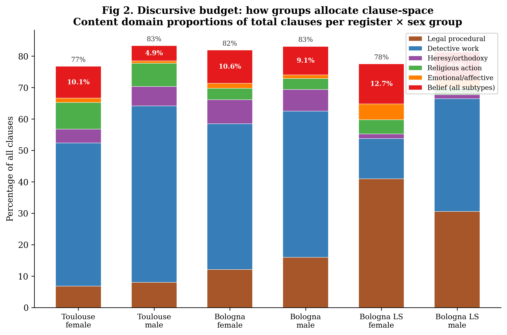

**Method**: Stacked bar chart showing percentage of total clauses allocated to six content domains: belief (all subtypes combined), heresy/orthodoxy, detective work (material support + social network + spatio-temporal + encounter interaction), religious action, emotional/affective, and legal procedural.

**What it reveals**: The hydraulic competition between content domains is immediately visible:

- **Toulouse and Bologna non-LS**: Detective work (blue) dominates at 45-56% of clauses. Belief is squeezed to 5-11%. These registers devote most clause-space to identifying persons, places, times, material exchanges, and social encounters.
- **Bologna LS**: Legal procedural (brown) expands to 35-41%, displacing detective work (13-36%). Belief's *share* rises to 8-13% not because absolute belief production increases, but because the investigative apparatus is stripped away.
- **Total tagged coverage** is consistent (77-83%), suggesting the CT taxonomy captures most clause content across all groups.

**Key reading**: Belief's visibility is partly an artifact of what else competes for discursive space. The LS campaign's compressed format eliminates detective-work, making belief proportionally more prominent.

### Fig 3. Belief Subtype Composition

**File**: `fig3_emm_belief_composition.png` (repo root). Belief-subtype
composition is robust across all three normalization methods (12.7% raw
/ 12.8% ILW / 15.3% EMM belief rate for Bologna LS female) — the finding
below holds regardless of which normalization produced it.

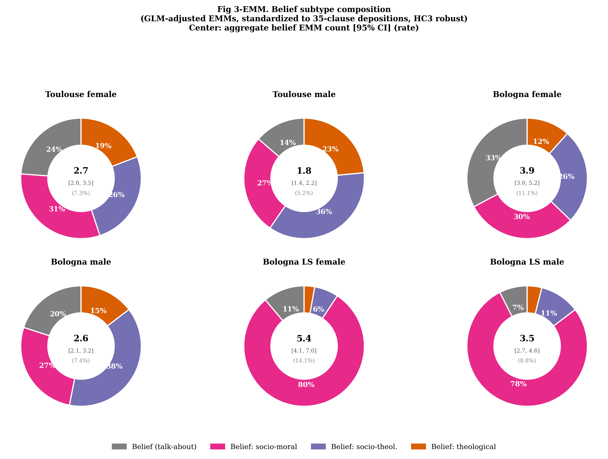

**Method**: Donut charts showing the within-belief distribution across four subtypes: talk-about-belief (grey), socio-moral (magenta), socio-theological (purple), and theological (orange). Center values show total belief clause count and clause rate.

**What it reveals**: The most dramatic register contrast in the dataset:

- **Toulouse and Bologna non-LS**: Balanced portfolios. All four subtypes range from 11-34%, with no single subtype dominating. These registers produce belief across the full spectrum (moral, doctrinal, institutional, meta-discursive).
- **Bologna LS**: Near-monopoly by socio-moral belief (87% for women, 76% for men). Theological belief is virtually absent (1-5%), and socio-theological is minimal (8-12%). The Liber Securitatum campaign's focus on moral surveillance (lying, oath-breaking, moral qualities of persons) is written directly into the belief profile.
- **Bologna female** stands out for the highest talk-about-belief share (28%) and lowest theological (6%), suggesting a distinctive discursive position even within the non-LS register.

**Key reading**: Register determines not just *how much* belief is produced but *what kind*. The LS campaign specializes in moral policing; Toulouse and Bologna non-LS investigate doctrine. This finding is robust across all three normalization sets.

### Fig 4. Hydraulic Competition: Belief vs. Suppressor Topics

**File**: `supplementary_analyses/descriptives_methodology_comparison/fig4_diverging_bars.png`

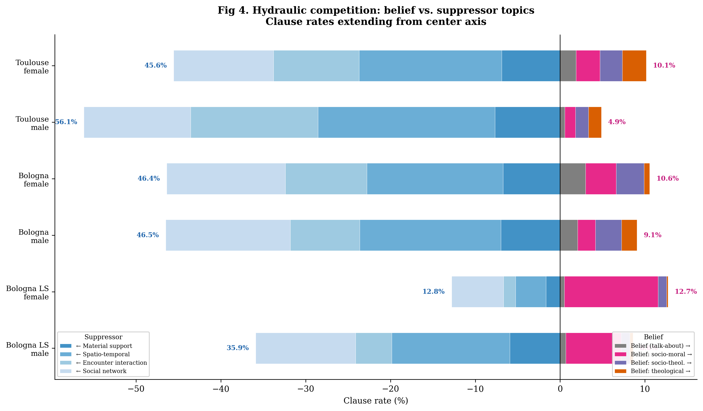

**Method**: Diverging horizontal bar chart. Suppressor topics (material support, spatio-temporal, encounter interaction, social network) extend leftward; belief subtypes (talk-about, socio-moral, socio-theological, theological) extend rightward. Totals annotated at bar ends.

**What it reveals**:

- **Bologna LS female** is the only group approaching parity between suppressors (12.8%) and belief (12.7%). In every other group, suppressors dominate by 4:1 to 12:1.
- **Toulouse male** shows the most extreme imbalance: 56.1% suppressor vs. 4.9% belief (ratio 11.5:1).
- The **composition** of the belief side shifts visibly: socio-moral (magenta) dominates the LS bars, while Toulouse/Bologna show diverse stacking across all four subtypes.

**Key reading**: The visual asymmetry makes concrete the regression finding that material/social facts strongly suppress belief-acting (OR ~ 0.00 for ct_ms_prop). Where detective work is present, belief is crowded out.

**Caveat**: The near-parity in Bologna LS female is a length artifact. Set 3 (EMM) shows suppressor:belief at 2.5:1 even in LS.

### Fig 5. Sex Differences in Content Topic Rates

**File**: `supplementary_analyses/descriptives_methodology_comparison/fig5_sex_slopes.png`

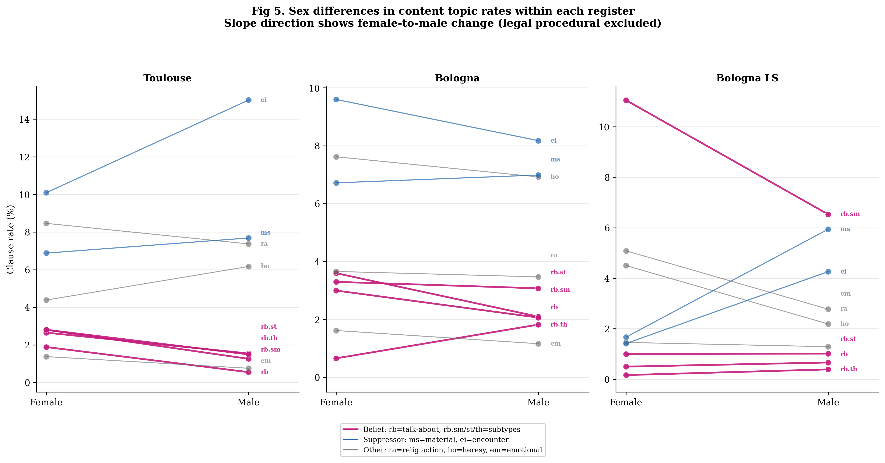

**Method**: Slope chart (paired dot plot) showing female-to-male change in clause rate for 9 content topics within each register. Legal procedural is excluded because it dominates the Bologna LS scale and obscures all other patterns. Short labels: rb=talk-about, rb.sm/st/th=belief subtypes, ms=material, ei=encounter, ra=religious action, ho=heresy, em=emotional.

**What it reveals**: Three distinct gendered patterns:

- **Toulouse**: Encounter interaction diverges sharply upward for males (10.1% to 15.0%), consistent with men's greater involvement in narrated social encounters. All belief subtypes slope mildly downward from female to male, with theological showing the steepest decline (2.8% to 1.5%).
- **Bologna non-LS**: Relatively parallel slopes; sex differences are modest. Encounter interaction slopes *downward* for males (9.6% to 8.2%), contrasting with Toulouse. Socio-theological belief is nearly identical across sexes (~3.3% vs. 3.1%).
- **Bologna LS**: Socio-moral belief rises from female to male (inverted from other registers). Material support and encounter interaction also rise sharply for males, suggesting the LS male profile is more "detective-like" than LS female. Emotional/affective content drops from 5.1% to 2.8%.

**Key reading**: Sex effects are register-specific, not universal. The interaction between sex and register means that "female" does not uniformly predict more or less belief — the institutional context modulates the gendered pattern.

### Fig 6. Per-Deposition Distributions

**File**: `supplementary_analyses/descriptives_methodology_comparison/fig6_distribution_summary.png`

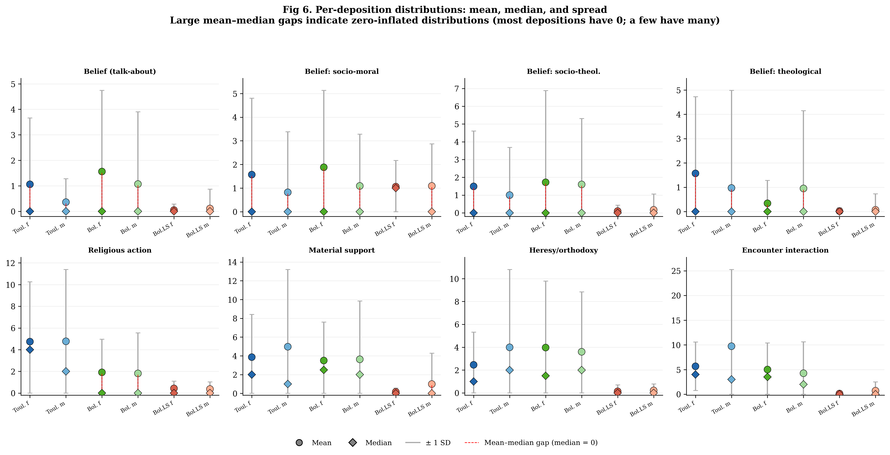

**Method**: For 8 selected content topics, shows per-deposition mean (circle), median (diamond), and +/- 1 SD (error bars, clipped at 0). Colors follow group assignment. Red dashed lines highlight cases where median = 0 while mean > 0 (zero-inflation).

**What it reveals**: Pervasive zero-inflation across all belief subtypes:

- **Belief subtypes**: Median = 0 in nearly every group. The only exception is Bologna LS socio-moral (median = 1 for women). Mean-median gaps show that group-level rates are driven by a minority of depositions with concentrated belief content. Most depositions contain zero instances of any given belief subtype.
- **Contrast with detective-work topics**: Religious action, material support, heresy/orthodoxy, and encounter interaction have non-zero medians in Toulouse and Bologna non-LS, indicating these topics are broadly distributed across depositions rather than concentrated in a few.
- **SD magnitude**: Theological belief in Toulouse male (mean=0.97, SD=4.01) and encounter interaction in Toulouse male (mean=9.72, SD=15.51) show extreme right-skew — a small number of depositions produce disproportionate counts.
- **Bologna LS collapse**: All topics except socio-moral belief show near-zero means and tiny SDs in Bologna LS, reflecting the compressed deposition format.

**Key reading**: Belief is intrinsically rare and clustered. The high deposition-effect variance in the GLMM models (e.g., 34.54 for theological) reflects this distributional reality — a few depositions produce most of the belief content, and the random intercept captures this individual-level "stage presence."

---

## Set 2: Inverse-Length Weighted (ILW) Figures

### Fig 1-ILW. Thematic Profile Heatmap

**File**: `supplementary_analyses/descriptives_methodology_comparison/fig1_ilw_thematic_heatmap.png`

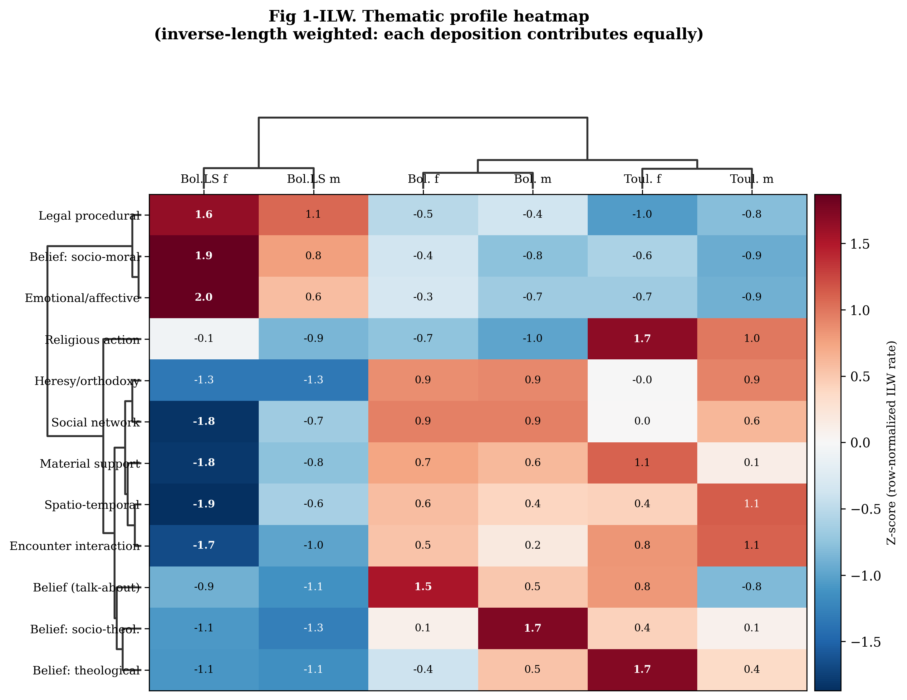

**Method**: Same as Set 1 Fig 1, but rates are computed as mean of per-deposition proportions (CT count / deposition length) rather than pooled clause rates.

**What changes**: The clustering structure remains similar but heresy/orthodoxy now clusters more tightly with detective-work topics. Legal procedural's Bologna LS z-score increases slightly (1.6/1.1) because short depositions have even more inflated proportions when averaged equally.

### Fig 2-ILW. Discursive Budget

**File**: `supplementary_analyses/descriptives_methodology_comparison/fig2_ilw_discursive_budget.png`

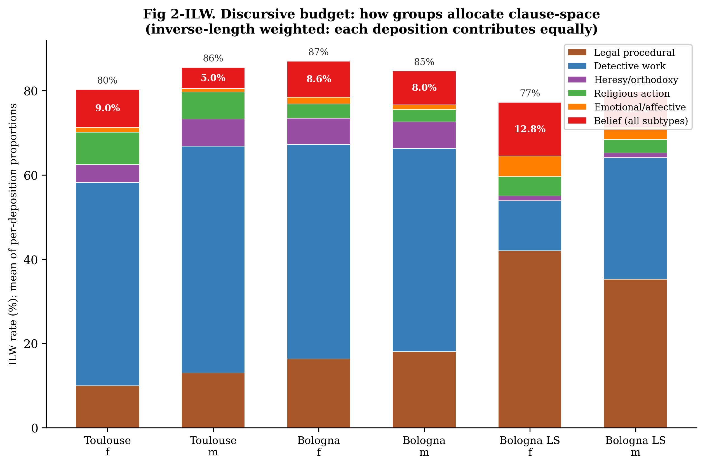

**What changes**: Legal procedural in Bologna LS female rises to 42% (from 41% raw). Bologna LS belief share stays at ~13%. The ILW corrects for long-deposition dominance in Toulouse/Bologna but worsens the fixed-cost inflation in Bologna LS.

### Fig 4-ILW. Hydraulic Competition

**File**: `supplementary_analyses/descriptives_methodology_comparison/fig4_ilw_diverging_bars.png`

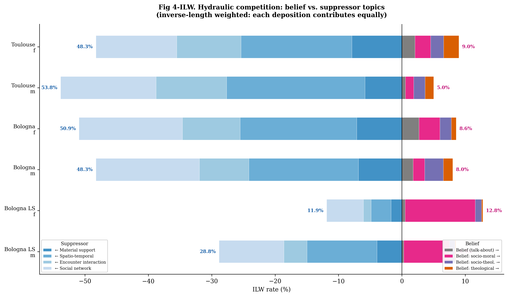

**What changes**: Bologna LS female now shows belief (12.8%) *exceeding* suppressors (11.9%), inverting the raw near-parity. This is the most misleading result — it occurs because ILW suppresses detective work in short depositions while belief (which is more "fixed cost" in LS) inflates proportionally.

### Fig 5-ILW. Sex Differences

**File**: `supplementary_analyses/descriptives_methodology_comparison/fig5_ilw_sex_slopes.png`

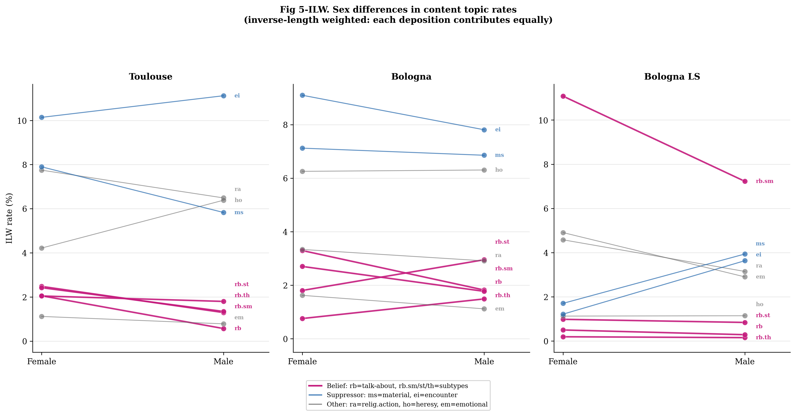

**What changes**: The Toulouse encounter interaction sex gap narrows substantially (raw: 10.1→15.0%; ILW: 10→11%). A few very long male Toulouse depositions with dense encounter reporting were inflating the raw male rate. Belief sex patterns remain stable.

### Fig 6-ILW. Per-Deposition Proportion Distributions

**File**: `supplementary_analyses/descriptives_methodology_comparison/fig6_ilw_distribution_summary.png`

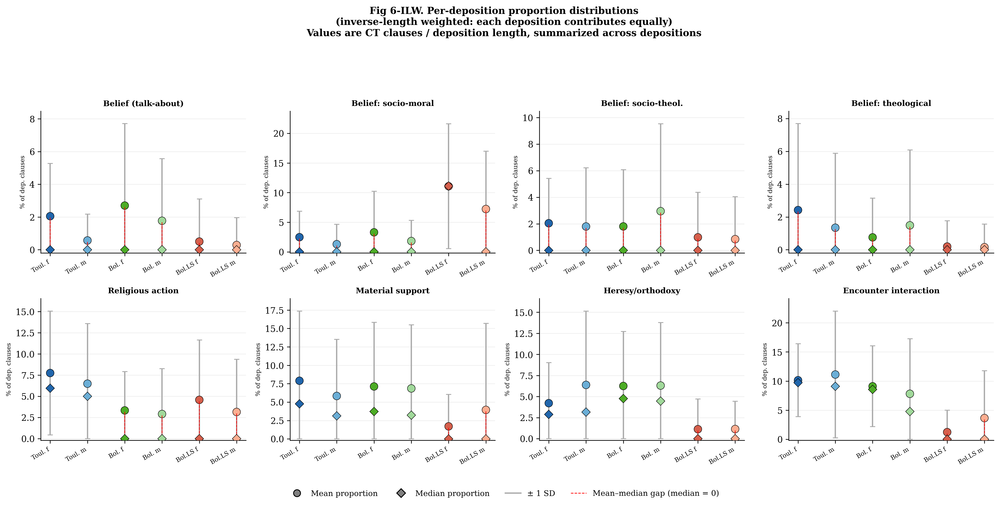

**Method**: Shows per-deposition *proportions* (CT count / deposition length) rather than raw counts. Mean, median, and SD of these proportions per group.

**What changes**: Groups become comparable in principle, but the zero-inflation pattern persists. Bologna LS socio-moral shows mean proportion of 11.1% with tight SD, confirming a broad institutional pattern rather than a few outliers.

---

## Set 3: GLM-Adjusted EMM Figures

### Fig 1-EMM. Thematic Profile Heatmap

**File**: `supplementary_analyses/descriptives_methodology_comparison/fig1_emm_thematic_heatmap.png` (dendrogram layout; `fig1_emm_popular_thematic_heatmap.png` at repo root shows the same EMM data in a no-dendrogram layout)

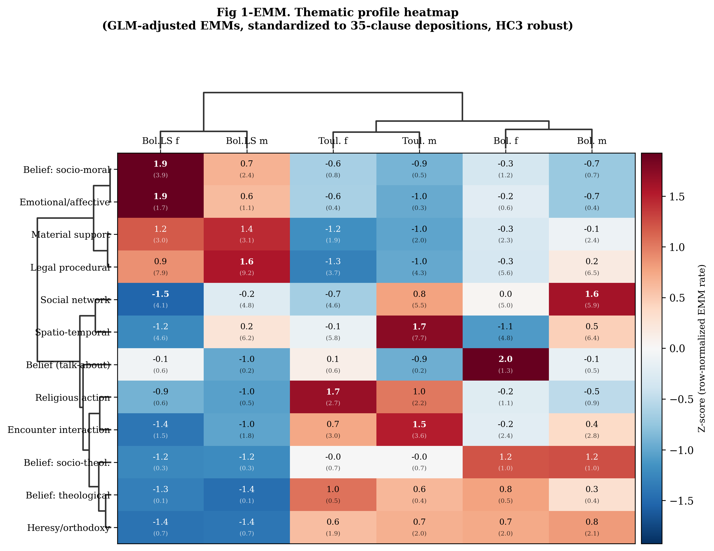


**Method**: Same heatmap layout, but rates are derived from GLM Estimated Marginal Means standardized to 35-clause depositions (HC3 robust). Each cell shows both the z-score and the underlying EMM count in parentheses.

**What changes**: The clustering structure shifts significantly:

- **Legal procedural no longer dominates the LS cluster.** It drops from z=1.7 (raw) to z=0.9, now clustering with material support. Both have superlinear length scaling that the GLM adjusts for.
- **Material support reverses direction.** Raw z=-2.2, ILW z=-1.8, EMM z=+1.2 for Bologna LS female. The GLM reveals that LS depositions have *elevated* material support when standardized to equal length. The raw suppression was entirely a length artifact.
- **The stable Bologna LS markers** are socio-moral belief (z=1.9), emotional/affective (z=1.9), and — now — material support. The LS campaign's distinctive signature is moral surveillance, emotional content, and material exchange, not procedural overhead.
- **Bologna female** emerges more distinctly, with belief talk-about (z=2.0) and socio-theological belief (z=1.2) as its markers.

### Fig 2-EMM. Discursive Budget

**File**: `supplementary_analyses/descriptives_methodology_comparison/fig2_emm_discursive_budget.png` (`fig2_emm_popular_discursive_budget.png` at repo root shows the same EMM data in a different layout)

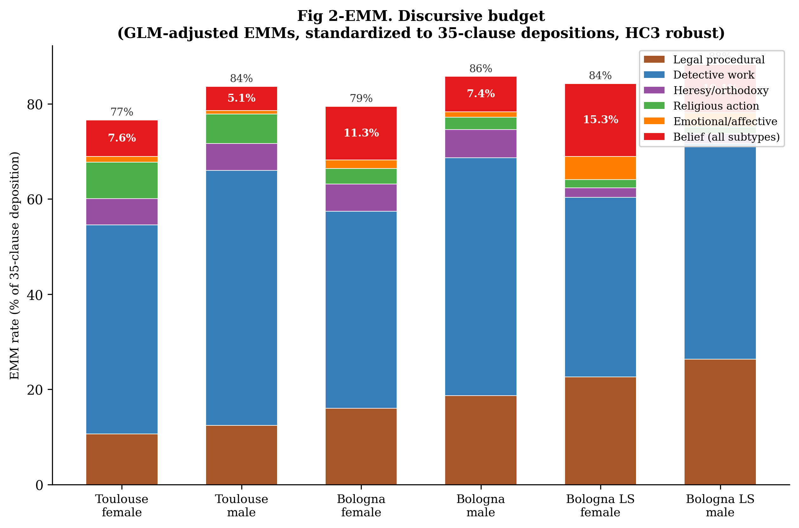
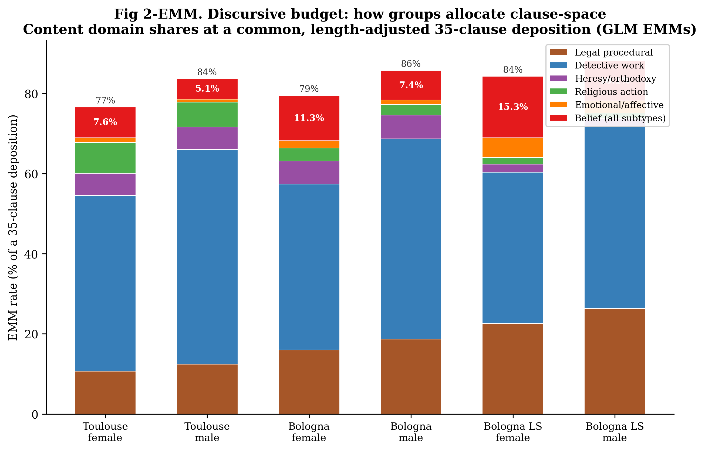

**What changes**: The bars are now directly comparable across groups. Legal procedural in Bologna LS female drops to 23% (from 41% raw / 42% ILW). Detective work in LS rises from the raw 13% to 38% — close to Toulouse's 44%. The belief share for LS female is **15.3%**, the highest of any group, confirming genuine belief elevation after proper length correction.

### Fig 3-EMM. Belief Subtype Composition

**File**: `fig3_emm_belief_composition.png`


**What changes**: Center values now show aggregate belief EMM counts with 95% CIs. Bologna LS female: 5.4 [4.1, 7.0] expected belief clauses per standardized deposition — double Toulouse female's 2.7 [2.0, 3.5]. The socio-moral dominance (80%/78% in LS) is robust across all three methods.

### Fig 4-EMM. Hydraulic Competition

**File**: `fig4_emm_diverging_bars.png`


**What changes**: The apparent LS near-parity disappears. Bologna LS female: suppressors 37.7% vs belief 15.3% (ratio 2.5:1). Suppressors still win everywhere, but the LS ratio is less extreme than Toulouse/Bologna (6-10:1). The composition of the suppressor side shifts: material support is now substantial in LS (8.5%), not negligible.

### Fig 5-EMM. Sex Differences with CIs

**File**: `fig5_emm_sex_slopes.png`

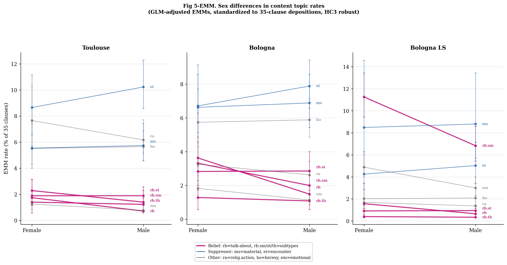

**Method**: Same slope layout, but now includes 95% CI error bars at each endpoint from the GLM. This shows where sex differences are statistically meaningful vs. uncertain.

**What changes**: Wide CIs in Bologna LS reveal substantial uncertainty for several topics — the small number of long LS depositions means that EMM extrapolation to 35 clauses carries inherent imprecision. The Toulouse encounter interaction sex gap is more moderate (8.7→10.2%) than the raw rate suggested (10.1→15.0%).

### Fig 6-EMM. Forest Plot of Expected Counts

**File**: `fig6_emm_forest.png`

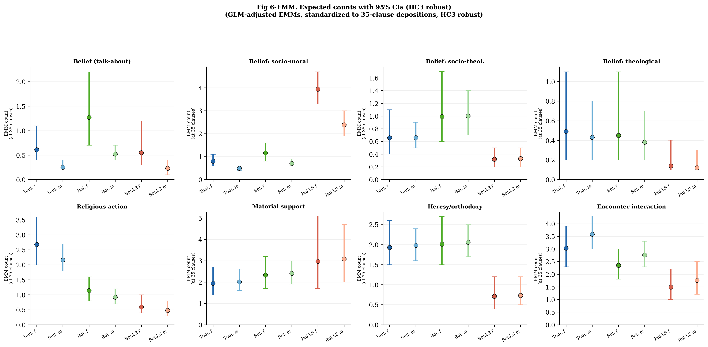

**Method**: Replaces the mean/median/SD strip chart with a forest plot of EMM counts and their 95% CIs. This is the proper basis for between-group statistical comparison.

**What it reveals**:

- **Socio-moral belief**: Bologna LS female (3.94 [3.3, 4.7]) is unambiguously the highest — CIs do not overlap with any other group. This is the strongest register × sex effect in the dataset.
- **Theological belief**: Bologna LS is near-zero (0.14 [0.1, 0.4] for women), with non-overlapping CIs against Toulouse. The doctrinal void in the LS campaign is statistically confirmed.
- **Material support**: Bologna LS shows *elevated* EMMs (2.97 [1.7, 5.1] for women), overlapping with or exceeding other registers. The raw/ILW suppression was a length artifact.
- **Encounter interaction**: Clear gradient from Toulouse (3.0-3.6) through Bologna (2.4-2.8) to Bologna LS (1.5-1.8), with mostly non-overlapping CIs.

---

## Analytical Context

These figures collectively address a single question: **how does the discursive ecology of inquisition depositions shape the conditions for belief-acting?**

The answer operates at three levels, and the normalization method matters for each:

1. **Competition** (Figs 2, 4): Belief competes with detective-work topics for finite clause-space. Where the investigative apparatus is present, belief is crowded out. The raw/ILW figures overstate the degree to which LS escapes this competition; the EMM figures show that detective work is reduced but not eliminated in LS, and the hydraulic ratio remains 2.5:1 against belief even there.

2. **Specialization** (Figs 1, 3): Different registers produce different *kinds* of belief. Bologna LS specializes in socio-moral belief; Toulouse and Bologna investigate the full doctrinal spectrum. This finding is robust across all three normalization methods — the within-belief composition is insensitive to length correction because it is a ratio of similarly-scaled quantities.

3. **Distribution and magnitude** (Figs 5, 6): Belief is zero-inflated and sex-modulated. The EMM forest plot (Set 3, Fig 6) provides the most defensible magnitude estimates with proper uncertainty quantification. Bologna LS female produces an expected 5.4 belief clauses per standardized 35-clause deposition — genuinely double the Toulouse female rate — confirming that the LS campaign's compressed format paradoxically intensifies belief-acting per unit of discursive space.

These descriptive patterns motivate the progressive GLMM model sequence, which formalizes and tests these relationships while controlling for the nested data structure.
